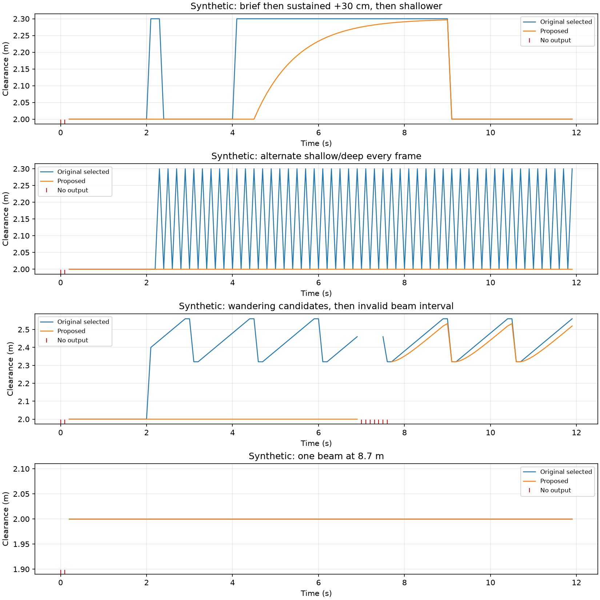
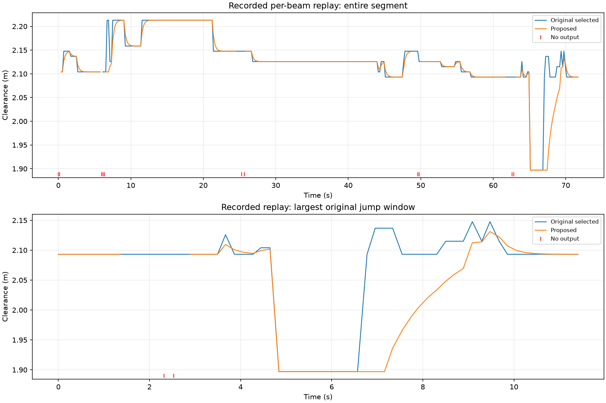
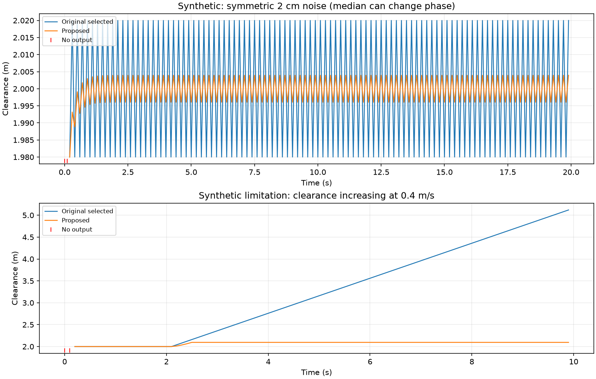

# Candidate persistence for DVL bottom range

Implemented for review on `SF-535`, against clean baseline
`20923bcb734e9957ff030bb9783e16757fe563ec`. No applicable `AGENTS.md` was found
in the checkout or its parent directories. No commits, deployment, service
restart, vehicle settings, or firmware changes were made.

## Algorithm and provisional defaults

The original checkout did project each valid positive beam by `cos(22.5°)`,
median its last three samples independently, require at least two mature beams,
and select the **second-smallest**, even with two or three usable beams. This
selection and projection are retained. Finite-number checks and unique beam IDs
now prevent infinity and duplicate beams from passing the usable-beam count.
Missing/invalid beams clear their own histories and need three new valid samples.
This intentionally strengthens recovery compared with retaining old beam history.

`dvl-a50/range_filter.py` applies persistence after selection, only for the
`beam_median` source. The existing `reported` source remains an unsmoothed bypass.
Defaults are named constants, not new live settings:

| Constant | Default | Reason and limitation |
| --- | ---: | --- |
| `RANGE_SWITCH_HYSTERESIS_M` | 0.10 m | Separates assumed centimetre-scale noise from the reported 20–30 cm switches. Symmetric boundary around current accepted output; significant means strictly beyond it. Not a measured noise percentile. |
| `RANGE_CANDIDATE_TOLERANCE_M` | ±0.05 m | A fixed anchor admits modest scatter but separates candidates 20–30 cm apart. No moving anchor that can follow a wandering return indefinitely and accumulate confirmation. |
| `RANGE_DEEPER_PERSISTENCE_S` | 0.5 s | Requested provisional persistence; completion is quantized to the next fresh sample. |
| `RANGE_DEEPER_TAU_S` | 1.0 s | Requested provisional exponential transition, retained to convergence for the confirmed candidate. |
| `RANGE_NOISE_TAU_S` | 0.25 s | Symmetric smoothing for small positive and negative errors; no switch timer. Limits noise without asymmetric downward ratcheting. |
| `RANGE_CONTINUITY_GAP_S` | 0.4 s | A larger inter-frame gap breaks continuity, cancels confirmation, and clears beam warm-up. Allows the usual approximately 5 Hz source with some jitter. Not a guarantee of PX4 fusion freshness. |

The first usable selected measurement initializes the output. An increase over
10 cm holds the output and anchors a candidate at that measurement. All subsequent
fresh selected readings must remain within ±5 cm of that anchor for 0.5 s.
Leaving its band restarts confirmation at the new candidate; returning within
10 cm of accepted output cancels pending confirmation and uses the noise LPF.

After confirmation the filter uses `alpha = 1 - exp(-dt/tau)` (computed accurately
as `-expm1(-dt/tau)`) towards each fresh measurement. Confirmation stays latched
while input stays in the candidate band, including as the output converges.
The confirmation frame takes one `dt` step; the preceding persistence duration
is never integrated as transition time. A materially different deeper candidate
requires a new delay. Small fluctuations within a confirmed candidate band use
the symmetric 1 s LPF until that band is left.

A decrease more than 10 cm below accepted output snaps immediately to the selected
measurement. This adds **no delay after the existing three-sample median**.
Small downward errors use the same LPF as upward errors; repeatedly taking the
minimum would ratchet down, and is deliberately avoided. The second-smallest
selection itself can still introduce a geometry-dependent bias. Biased noise or
large shallow outliers are not corrected by symmetric small-error smoothing.

## Invalidity, continuity, and recovery

- No usable selection, invalid velocity, nonfinite/nonpositive distance, invalid
  transmission timestamp, stale/future frame, duplicate timestamp, or rewind
  produces a new range observation. Pending confirmation is discarded.
- Missing individual beams must mature again; if at least two other mature beams
  remain, selection continues. Fewer than two mature beams invalidates the
  accepted estimate. Recovery initializes from its first usable selection.
- Gaps **over 400 ms** clear beam histories and the accepted estimate. Recovery
  needs three fresh beam samples (0.4 s warm-up at 5 Hz, 0.2 s at 10 Hz), then
  initializes directly, potentially at a different range. Old values are not
  filled into the gap. These recovery jumps deliberately bypass persistence.
- Duplicate/rewound frames are rejected and clear histories. The timestamp guard
  rebases on rewind so subsequent increasing, wall-clock-current samples can
  recover instead of being locked out until the previous timestamp is reached.
  An isolated out-of-order packet therefore also conservatively forces warm-up.
- Source-mode changes, mounting changes, and starting a new socket connection
  clear histories and filter state. A new connection also clears the source
  timestamp guard. The reported-altitude bypass retains its existing behavior.
- There is no timer callback or publication on missing input. The driver emits
  at most once per fresh valid input, limited by a 0.05 s send
  interval. Invalid input never republishes the last accepted value. A fresh
  deeper candidate can intentionally publish the held estimate.

Persistence measures elapsed time between consecutive valid observations within
the continuity limit. Without sequence numbers or a fixed configured sample rate,
a skipped sample inside a <=400 ms interval cannot be distinguished from a slower
source. Such intervals are assumed continuous; detected gaps and explicit invalid
samples never carry confirmation across them. Sources slower than 2.5 Hz cannot
warm up under this policy and need a different explicit continuity setting.
The existing ±1 s wall-clock sample-age check is unchanged; this can admit input
whose actual age already exceeds PX4's fusion timeout. Clock alignment and
transport delay still matter.

## Validation and replay

Run from the repository root:

```sh
python3 -m unittest discover -s dvl-a50 -p 'test_*.py'
uv run --no-project --with black --with isort --with pylint ./.hooks/pre-push
uv run --no-project --with pylint pylint dvl-a50/range_filter.py dvl-a50/test_range_filter.py dvl-a50/replay_range_filter.py
uv run --no-project --with matplotlib --with mcap-ros2-support --with mcap --with loguru --with python3-nmap --with requests python dvl-a50/replay_range_filter.py /path/to/recording.mcap
```

Validation passed: **32 tests** on host Python 3.14 and Python 3.9; repository
pre-push checks (isort, Black, pylint), explicit pylint on all new Python files,
and `git diff --check`. Pylint reports 10.00/10. No container build or hardware
validation was performed.

The replay loads the **exact original driver from the pinned Git baseline** and
compares it with the candidate driver. It never starts driver threads or invokes
network operations. Tests cover symmetric noise/no drift, brief/sustained steps,
alternation, wandering and noisy stable candidates, a second beam switching
between different bottom depths, 8.7 m single-beam excursions, prompt shallower
response, insufficient/duplicate/invalid beams, invalid velocity, recovery,
source/mounting/socket reset, invalid/stale/duplicate/rewound timestamps, gaps,
and regular 5/10/20/50 Hz plus irregular sampling. Publication tests mock MAVLink
and verify invalid/duplicate input cannot resend a held observation.

At 10 Hz, the synthetic 30 cm deeper step starts at 4.0 s, is selected at 4.1 s,
and first moves the candidate output at 4.6 s: **0.5 s after selection**.
It reaches 63.2% at 5.5 s and 95% at 7.5 s: **1.4 s and 3.4 s after selection**,
respectively. There is no repeated persistence pause while converging. A shallower
step at 9.0 s reaches the output at 9.1 s, exactly when the median selects it.
The 0.3 s deeper pulse and alternating deeper frames are suppressed. These are
filter-level times; the existing send limiter and transport can add latency.



A suitable local recording was available:
`/Users/david-sunfish/Downloads/flight-20260910T090544Z-1789031144087079452/telemetry/00010.mcap`.
Replay uses `/px4/dvl_beam_data` ranges, validity, beam presence and sensor timestamps:
348 frames over 71.682 s, with no non-increasing timestamps and three gaps over
400 ms. This is downstream recorded beam telemetry, not original TCP ingress;
it cannot recover lost frames or prove the wall-clock freshness guard, TCP
coalescing, MAVLink send schedule, PX4 fusion, or actual terrain truth.

| Recorded replay metric | Original | Candidate |
| --- | ---: | ---: |
| Largest consecutive increase | 19.62 cm | 4.72 cm |
| Largest absolute consecutive change | 20.71 cm | 20.50 cm |
| Frames with no output | 3 | 11 |

The large shallow change is intentionally preserved. The maximum selected range
minus candidate output is **23.98 cm**. The additional invalid frames arise from
stricter discontinuity/recovery handling; no held gap values are published.
The recording supports the presence of switches but does not calibrate the
10 cm/5 cm thresholds, nor distinguish bottom geometry from actual motion.
Numerical results are saved in [metrics.json](range-smoothing/metrics.json).



## PX4 freshness and navigation implications

Read-only source review used `/Users/david-sunfish/repo/PX4-Autopilot`, HEAD
`c1a81edb74dc2fbd5ddedd1a4df42c284590300e`; this is checkout evidence, not a claim
about deployed firmware:

- `src/modules/mavlink/mavlink_receiver.cpp:1104` timestamps DISTANCE_SENSOR at
  **receiver arrival**, ignoring sender timestamps. Fresh input that causes a
  held output therefore becomes an apparently new range observation in PX4.
- `src/modules/ekf2/EKF/aid_sources/range_finder/sensor_range_finder.hpp:58`
  defines `RNG_MAX_INTERVAL = 200e3` microseconds.
- `src/modules/ekf2/EKF/terrain_control.cpp:102` uses twice that interval,
  **400 ms since last successful range fusion**, for UUV range-based terrain
  validity. `range_height_control.cpp` also stops UUV range fusion on this
  timeout. It is not simply a received-packet timeout.
- `dvl-a50/mavlink2resthelper.py` still sends covariance `0`, unknown signal
  quality, and centimetre-quantized distance. The filter adds no uncertainty
  metadata. `range_height_control.cpp:getRngVar()` derives observation variance
  from state variance, `EKF2_RNG_NOISE`, and distance scaling; it has no knowledge
  of candidate delay or the temporal correlation introduced here.

Holding on fresh input can allow repeated fusion to maintain apparent freshness,
while the output reflects an older accepted clearance. It does **not** guarantee
fusion: quality, innovations, range-rate/vertical-velocity consistency, and other
checks still apply. The filter neither inflates uncertainty nor communicates that
the observation is held, so fusion may be overconfident in delayed/correlated
information. Suppressing all output for the 0.5 s persistence period instead
would exceed the 400 ms window if there were no successful intervening fusion;
that is why this implementation continues to emit on valid candidate input.
The former 5 Hz publication cap let scheduling jitter or packet loss threaten
the 400 ms margin. The range cap is now 20 Hz, above the documented 2-15 Hz
sensor report rate, so normal reports are not discarded by the send limiter.

**This is a candidate filter, not validated for unrestricted navigation.** It
cannot distinguish a beam switching to deeper bottom from a genuine drop-off or
vehicle ascent. It underestimates clearance during a real increase, can affect
terrain/height fusion and kinematic consistency, and can delay bottom-following
descent. It preserves the response to a large decrease but small decreases are
smoothed, and the three-sample median still delays obstacle recognition.

The fixed-band requirement has an important unbounded failure mode: a continuously
wandering deeper input can prevent confirmation indefinitely. In the explicitly
synthetic 0.4 m/s increasing-clearance ramp, the selected value reaches **5.12 m**
while the candidate remains **2.095 m**. This can represent vertical motion or a
bottom slope crossed horizontally; it is not a claim about this vehicle's speed.
The behavior follows directly from rejecting wandering candidates and is not
resolved by this short static recording. Recovery after invalidity can also
jump directly to a deeper initialization value.



If the operational problem is abrupt navigation demands rather than unreliable
range returns, smoothing/slew-limiting the **navigation clearance/depth target**
is preferable: it can preserve fresh sensor range, estimator range-rate
consistency, and prompt bottom protection while limiting commanded motion.
That would need a separate navigation-path review and validation. No firmware
change is needed to review this candidate, and none was made. Before deployment,
use synchronized range, vertical velocity/depth, fusion flags, terrain validity,
and navigation targets over known slopes and vertical maneuvers to decide whether
measurement filtering belongs in this path at all. The provisional defaults are
not established by screenshots or by this replay alone.

## September 11 publication-rate fix

The first fix changes only `RANGEFINDER_PERIOD_S` from 0.2 to 0.05 seconds.
Odometry remains capped at 10 Hz. Beam selection, persistence, freshness checks,
invalid-velocity suppression, and three-sample recovery remain unchanged.

The [A50/A125 protocol](https://docs.waterlinked.com/dvl/dvl-json-protocol/)
ties valid reported altitude and velocity to `velocity_valid`. It lists
`beam_valid` but does not explicitly guarantee independent range validity when
the overall velocity solution is invalid. Removing that gate requires further
vendor evidence; four true beam flags alone are insufficient justification.

Replay through both actual `handle_velocity` implementations used baseline
`e0280f754bc54f582fa00efd2704200ce9adfda7` and 2,505 recorded beam frames over
286.988 seconds from September 11's `00003.mcap`:

| Metric | Baseline | 20 Hz cap |
| --- | ---: | ---: |
| Simulated range publications | 1,111 | 2,242 |
| Publication gaps over 400 ms | 64 | 50 |
| Time beyond 400 ms since publication | 20.613 s | 16.757 s |
| Longest publication gap | 2.125 s | 2.125 s |

These are simulated publication gaps, not predicted mission-warning counts.
PX4 beam receipt timestamps approximate bridge ingress; missing recorded frames,
HTTP/MAVLink delays, and EKF fusion are not simulated. Initial filter warm-up is
excluded from the stale-time metric. The change reduces rate-limit-induced gaps
but does not fix invalid-velocity outages or prove live improvement.

```sh
uv run --no-project --with mcap --with mcap-ros2-support --with loguru \
  --with python3-nmap --with requests python dvl-a50/replay_range_publication.py \
  /path/to/00003.mcap --duration 287 --output /tmp/publication-metrics.json
```

All 36 unit tests passed on host Python and Python 3.9. New publication tests
cover 5/9/10/15 Hz with jitter, burst limiting, invalid velocity, insufficient or
nonfinite beams, stale/future/duplicate frames, outage recovery and disabled
output. No firmware timeout or innovation gate was changed.

Deployed September 11 to `10.9.4.3` through Kraken as
`sunfishrobotics.water-linked-dvl:range-rate-20260911-armv7`. The ARMv7 image
passed all 36 tests with networking disabled before installation. Archive SHA256:
`31851f4e816135a7274e496621ed340e9dcbefef9cf1c6728369d99601b85765`.
The running container has `RANGEFINDER_PERIOD_S = 0.05`, zero restarts, and the
existing `/root/.config` bind. DVL host `10.9.4.12`, reversed-down orientation,
`beam_median`, enabled rangefinder, and ODOMETRY settings were preserved.

Post-install `/get_status` reported Running. Over approximately 15 seconds the
PX4 DDS gateway received 104 new distance-sensor messages (6.91 Hz) and 128 beam
messages (8.51 Hz), with zero decode errors. Invalid DVL velocity still occurred
in extension logs. This proves updated range flow through PX4 to the gateway,
not elimination of mission warnings. A direct PX4 shell read failed with EOF;
no mission or vehicle motion was commanded during verification.
